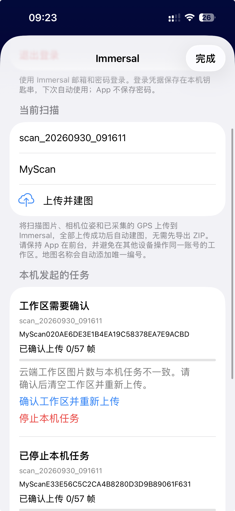

# Immersal 上传页界面审查

日期：2026-09-30。依据用户提供的真机截图；范围是「上传前工作区需要确认」这一屏，不声称已完成所有上传步骤的实机体验审查。

## 已观察步骤

1. 上传页处于等待工作区确认状态：主要操作不清晰，需要整理。顶部仍呈现上传入口，下面又出现重传入口；当前扫描及已停止任务混在同一长页面。

## 问题与改进

| 截图中的问题 | 影响 | 改进 |
| --- | --- | --- |
| 扫描文件名在当前扫描、当前任务、已停止任务重复出现 | 难判断哪个是本次操作 | 主视图只显示本次扫描时间、帧数和短地图名称 |
| 地图名称附带长唯一编号，放在显眼位置 | 技术信息盖过任务状态 | 默认显示短名称；完整云端名、文件名和地图 ID 放到详情 |
| 上传按钮与清空重传按钮同时出现 | 下一步有歧义 | 当前任务只显示一个主操作，状态决定按钮文案 |
| 在 0/57 时显示空进度条 | 容易误认为上传卡住 | 上传开始前显示「尚未上传」；实际上传后再显示进度 |
| 多行技术解释占用首屏 | 用户要滚动才能处理问题 | 首屏只保留行动所需的一句话；删除范围放进清空确认 |
| 已停止任务与待处理任务同等显著 | 历史淹没当前操作 | 历史折叠、独立页面或分栏，不显示无意义的进度条 |
| 红色停止操作紧邻主要恢复操作 | 易误触、增加决策负担 | 停止放到更多操作内，继续提供明确确认 |

保留已有优点：原生 iOS 控件、系统分享和账号登录方式一致；云端清空已经要求明确确认。本次整理不改变扫描、双格式导出、原始数据保留及建图能力。

可见的可访问性风险：说明文字较浅且密集，长编号挤占阅读空间，状态变化与下一步关联不足。需要后续实机核对动态字体、VoiceOver、深色模式、点击目标和实际颜色对比；截图不能证明这些已通过。

## 设计方向

- 当前任务优先：现有页面结构最接近，突出本次扫描和一个操作，历史只留下简短入口。
- 本次与历史分开：以「本次上传／历史任务」切换，将当前流程与历史彻底区分。
- 分阶段引导：展示准备、上传、建图三个阶段，以当前步骤驱动页面内容。

三种方向都保持原生浅色 iOS 视觉、蓝色主操作和清楚的删除确认；生成图是设计草图，工作区图片数量不会凭空当作真实数据展示。

实现顺序：先完成此前已批准的工作区数量确认与自动继续；选定界面方向后在现有 SwiftUI 项目内实施布局，不另建网页应用。
