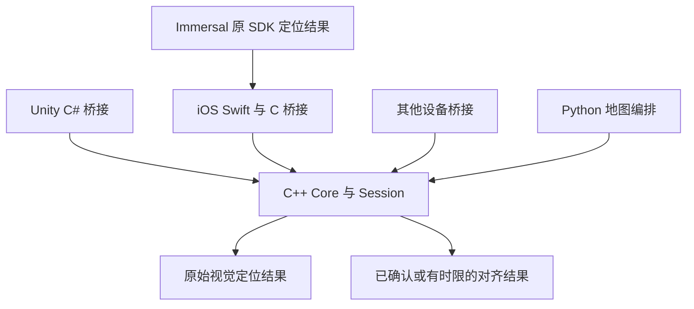

# OpenCV 5 之后的识别率定位稳定性与对齐精度提升方案

更新日期：2026 年 10 月 5 日。适用基线：本地 develop `802e1bb`，以及当前工作区已有的待提交 iOS 定位与 Immersal 功能。

本文用于选择下一轮算法与产品改进，覆盖空间识别、绝对位姿、连续使用、失锁恢复和网格叠加。项目自有依赖已统一为 OpenCV 5.0.0 + contrib；Immersal 保留原 SDK。升级完成了兼容适配，没有建立真实场景识别率提升的证据，详见[升级验收记录](/Users/dirui/Documents/Area-Target-Scanner/docs/opencv5-upgrade-validation.md)。

**建议先完善真实评测与采集质量，处理现有回退和重定位分支，再改善几何门控及跨帧对齐；随后以 ALIKED + LightGlue 为第一组学习特征实验，DISK + LightGlue 为对照。** 这个顺序依据当前源码缺口和集成成本提出，收益大小需要现场数据确认。原始审查描述的是上述 develop 基线。后续第一阶段按用户要求在 `codex/localization-quality` 隔离分支实施，具体完成与测试状态见该分支的 `docs/superpowers/specs/localization-quality/tasks.md`。

## 一 先区分需要提高的指标

“识别到了”“位姿正确”“画面稳定”“网格对齐”是不同结果。增加匹配点、放宽阈值或长时间保持旧锚点，都可能让成功计数变高，却没有提高真实精度。

| 指标 | 建议定义与单位 | 如何判断改善 |
| --- | --- | --- |
| 正确定位召回率 | 正场景中，地图身份正确且位姿满足冻结精度门槛的帧数 / 全部有效正样本帧 | 在误接受率和资源预算不恶化的条件下提高 |
| 定位输出率 | 引擎返回有效刚体位姿的次数 / 全部有效尝试 | 没有独立真值时可测，但不能直接称为正确识别率 |
| 误接受率 | 错误场景、错误地图等负样本被接受的次数 / 全部有效负样本尝试 | 单独统计错误地图、重复走廊、反光和动态物体；越低越好 |
| 错误定位占比 | 所有被接受结果中，地图或位姿不满足真值门槛的结果占比 | 包含正场景内的错误位置，不能只测错误场景负样本 |
| 首次确认时间 | 从测试开始到第一个被确认且正确的定位结果，单位秒 | 报告 P50/P95，并保留超时与完全失败的会话 |
| 重定位恢复时间 | 从人为遮挡、失锁或跳到另一位置，到重新确认正确位置，单位秒 | 与首次定位分开；未恢复的会话不能从分母删除 |
| 连续可用率 | 已确认且未过期的定位可用时长 / 测试总时长 | 同时报告原始视觉定位可用率、ARKit 辅助保持时长及降级时长 |
| 绝对位姿误差 | 相对独立真值的平移误差，单位米；旋转测地角，单位度 | 报告 median/P95、成功覆盖率，避免只比较容易成功的帧 |
| 对齐抖动 | 在同一地图及同一 AR 世界批次内，地图到 ARWorld 变换的相邻变化 | 用平移和旋转分别统计；不能把正常相机运动当作抖动 |
| 漂移与跳变 | 固定控制点在移动后的偏移，以及超出门槛的对齐跳变次数 | 分别统计每分钟跳变、路线末端误差、跟踪重置后的错误复用 |
| 网格叠加误差 | 多个已测控制点或真实边缘与模型对应点的偏差，单位厘米 | 覆盖远近和不同方向，不能只观察一个锚点 |
| 尺度误差 | 模型控制距离 / 真实测量距离减 1，以百分比记录 | 与平移、旋转误差分开；刚体平滑不能修正尺度问题 |
| 检索召回 | 正确且可定位的参考帧是否进入候选 Top K | 用于区分“没找到候选”和“匹配器失败” |
| 延迟与结果年龄 | 提取、检索、匹配、PnP、端到端各段 P50/P95；当前时刻减曝光时刻 | 同时测排队、复制、模型加载；算法耗时小不代表结果新鲜 |
| 运行成本 | 峰值内存、地图/模型大小、载图时间、温升、持续使用耗电 | 在目标 iPhone/iPad 上测，不套用桌面 GPU 的 FPS |

真值应来自独立测量，例如已标定并测量位置的控制点或外部测量系统，并记录不确定度。同一套 ARKit 跟踪可以帮助评价相对稳定性，不能同时作为“独立绝对精度真值”。没有真值的项目明确标为未测。

当前 App 已有成功率、首次识别、P50/P95 耗时及共同扫描原点的对齐变化。其 20 次尝试、30 秒、3 米、80% 成功、3 秒 P95、0.25 米/5°变化等是现有经验筛查配置，不能直接升级为生产验收要求；首次识别时间门槛当前为 10 秒。现有 live 首次识别从首个有效尝试的采集时间计算 offset 加结果延迟，recordedReplay 则累计算法调用耗时；后者不能当作用户首次确认的完整等待时间。新的首次确认指标应另区分含加载的冷启动和地图已加载的热启动。见[现有评估实现](/Users/dirui/Documents/Area-Target-Scanner/ios_scanner/AreaTargetScanner/Services/LocalizationEvaluation.swift:27)。

## 二 当前实现与优先检查项

下表来自当前源码阅读，包含尚未提交的 iOS 功能。它描述可核实的实现和缺口，不表示这些缺口已经在现场量化，也不代表已完成修复。

| 链路 | 已经具备 | 优先检查或改进 |
| --- | --- | --- |
| 采集 | ARKit normal 限制，按时间或位移拍关键帧，保存内参、方向和跟踪 run | 缺少图像清晰度、曝光及视角新颖度门控；当前 coverageArea 是路径 XZ 包围盒，不能代表有效视觉覆盖 |
| 建图特征 | ORB、AKAZE、每帧内参、射线与网格求交生成 3D 点、移动特征预算 | 限帧仍按序号均匀选取；应按质量与空间/视角覆盖选择，而非简单增加帧数 |
| 光照预处理 | 查询侧有 CLAHE 局部对比度增强 | 建图侧直接从灰度图提取，存在不一致；比较统一预处理的候选地图 |
| 候选检索 | Hamming BoW、TF-IDF、全局候选和上一定位附近候选 | 附近候选非空但全部匹配失败时，没有继续升级到全局检索 |
| 局部匹配 | Hamming KNN、ratio、绝对距离回退及双向互检 | 检查重复纹理、关键点空间分布和候选歧义；不要只放宽 ratio |
| AKAZE 回退 | 已有实现和独立定位路径 | ORB 特征不足会提前 LOST，绕过后续 AKAZE；回退仍受 ORB 候选集合约束 |
| 几何位姿 | PnP RANSAC、最低内点数/内点率、内点迭代精化 | 补重投影残差、空间覆盖、正深度及几何退化判据；confidence 当前主要由内点数生成 |
| Native/Unity 稳定性 | Native MAD 门控，Unity 多帧对齐和 Kalman 滤波 | Native 统计量是变换与单位矩阵之差的范数；Unity 失帧分支使用失败结果的 pose，需专项回归确认 |
| Swift iOS 稳定性 | 同帧图像/内参/AR pose，串行节流，generation 防旧会话结果，跟踪中断结束测试段 | 单次成功更新对齐、单次失败隐藏；尚无连续确认、失败宽限、同会话结果年龄门控和 SE(3) 平滑 |
| Immersal 网格叠加 | 多关键帧刚体共识、来源与单位验证、保持原模型原点 | 当前是 medoid 共识，不是 ICP；不能修正地图尺度或长路线非刚体漂移 |

关键源码入口见文末。优先为提前 LOST、附近搜索失败、失帧 pose 和跟踪重置构造回归样例，再决定修改方式。代码分支问题与真实场景失败的因果关系仍需诊断数据确认。

## 三 提升识别率的主要方式

### 1 改善采集和地图覆盖

对目标用户常站的位置、手机朝向和观察距离补采，覆盖斜视、较近/较远、不同高度和常见光照。让静态纹理在多个有视差的视角中出现；进入房间和跨区域时保留连接视图，避免只有原地转动或互不重叠的照片。Immersal 官方建议约三分之一到一半的图像重叠，并让重要特征至少出现在三个相近但不同的视角中；这些可作本项目采集起点，实际重叠需求再验证。[Immersal 建图指导](https://developers.immersal.com/docs/mapsmapping/howtomap/)

新增模糊、曝光饱和、纹理数量、特征分布、角速度和视角新颖度评分；保留低质量帧及其原因用于诊断，但不让它们挤占地图预算。当前移动质量模式已有 80 帧、每帧 2000 ORB 与 500 AKAZE 的上限，应先提高这些预算内的有效信息密度。

地图选择侧联合考虑清晰度、空间位置、朝向、共视关系和重复程度。弱区域给出补采提示。采集 UI 的路径面积、ARKit rawFeaturePoints 数量、网格面数，应与“可定位视觉覆盖”分别显示。

适用：建图姿态与使用姿态不同、局部区域难识别、强运动模糊、夜间/背光。限制：白墙、镜面和移动屏幕本身缺少稳定信息，学习模型也不能保证恢复不存在的对应关系。

### 2 统一预处理并保留几何校准

先比较“现状”“建图与查询均使用相同 CLAHE”“双方不使用 CLAHE”等候选，冻结参数、颜色/灰度、缩放及像素方向。修改建图侧提取流程后重建候选库，保留原地图作基线；不能只把旧库标成新版本。

任何旋转、裁剪、去镜像或缩放都必须对应更新内参和坐标映射。畸变校正后使用校正后的内参，避免重复校正。用实际送入定位器的像素和 K 回放，避免训练/评测读 JPEG、运行时读另一套裁剪后的图像。

适用：跨光照、跨设备、竖横屏切换、特征丰富却 PnP 不稳定。限制：过强对比度增强可能放大噪声；效果必须用正负样本一起验证。

### 3 先补齐现有 ORB 与 AKAZE 恢复路径

让低 ORB 特征的输入也有机会进入独立 AKAZE 回退；当附近候选全部失败时，扩展到全局候选，而不是仅在候选为空时全局检索。为回退提供可行的候选策略，并分别记录触发原因、独立救回次数和额外耗时。

查询分成快路径和恢复路径：稳定状态优先少量附近候选；明确失败后才扩展检索、增加候选或调用较贵算法。所有扩展受时间和资源预算约束，不能让高成本失败请求阻塞后续新帧。

适用：离开上一次定位附近、遮挡后恢复、ORB 弱但 AKAZE 仍可提取信息。限制：AKAZE 不是所有失败的解法；它的候选和地图特征也需要覆盖目标视角。

### 4 改善全局检索和地图组织

先测候选 Recall@K，再调 Top K、相似度阈值、附近半径及朝向排序。当前 BoW 是字节浮点 KMeans 后选 Hamming medoid，可比较更适合二进制描述子的词典；另一条路线是使用独立全局图像描述子检索，再用现有或学习局部特征做几何验证。

大场景可以按房间或区域组织地图，保留区域连接与地图间测量变换。重复走廊、楼层和相似房间必须进入负样本集。检索分数只能决定候选，不能直接宣布定位成功。HLoc 展示了“全局检索→参考图像局部匹配→3D 定位”的分层架构，并支持 NetVLAD 等检索器，可作为实验工具参考。[HLoc 官方仓库](https://github.com/cvg/Hierarchical-Localization)

适用：地图较大、候选遗漏、重复区域、载图和查询成本高。限制：分区边界会造成新的漏检，需要连接区域验收；新增检索模型也有内存和端侧推理成本。

### 5 接入学习特征和学习匹配

ALIKED、DISK 是关键点与描述子提取器，LightGlue 是对两幅图像的关键点和描述子进行对应匹配的网络。它们不负责单独输出本项目所需的绝对地图位姿。LightGlue 官方提供与 ALIKED、DISK、SuperPoint、SIFT 对应的预训练匹配器，没有为当前 ORB/AKAZE 提供可直接替换的预训练配置。[ALIKED 官方实现](https://github.com/Shiaoming/ALIKED)、[DISK 官方实现](https://github.com/cvlab-epfl/disk)、[LightGlue 官方实现](https://github.com/cvg/LightGlue)

| 候选 | 建议角色 | 潜在价值与待验证点 |
| --- | --- | --- |
| ALIKED + LightGlue | 第一组离线候选 | 检验跨视角、光照变化下的有效几何匹配；“轻量”不等于已经适合本项目 iPhone 延迟预算 |
| DISK + LightGlue | 同输入对照 | 检验学习特征对当前失败域的价值，比较精度、内存、关键点数量与延迟 |
| SIFT + LightGlue | 经典特征与学习匹配的对照 | 帮助区分收益来自提取器还是匹配器，同样需要新地图描述子与 runtime |
| SuperPoint + LightGlue | 可选研究基线 | 官方支持的常见组合；采用具体实现和权重前需单独核对其许可证 |
| 稠密匹配如 LoFTR | 高成本恢复实验 | 仅在稀疏匹配失败域有证据时评估；HLoc 已提供这种 matcher 接口，端侧成本需另测 |

以上价值是本项目的实验假设，不是模型之间的已测排名，也不是承诺学习模型一定胜过 ORB/AKAZE。

接入需要完成整条定位链路：

1. 用固定模型重新提取参考图像特征，保存关键点、描述子及与原图坐标的关系。
2. 给参考关键点建立可信的 3D 对应。可先复用经质量验证的射线/网格交点；若采用多视图 SfM，应维护特征轨迹和地图坐标/尺度关系。
3. 查询提取器使用同一特征家族和预处理；LightGlue 输出查询点到参考点的对应，再通过参考点的 3D 关联形成 2D–3D 匹配。
4. 继续执行 PnP、几何质量判断、跨帧确认和对齐。图像对的匹配增加，不等于正确绝对定位增加。
5. 新增有版本的地图特征格式或独立特征表、reader 和能力协商；不能把浮点描述子当作 ORB 的 32 字节或 AKAZE 的 61 字节，并继续使用 Hamming BoW。
6. 固定模型配置、权重 SHA、描述子维度/类型、距离定义、预处理、地图 producer 和缓存身份；保留旧地图与 ORB/AKAZE 回退。
7. 新增支持学习描述子的 native 接口或旁路定位后端，并适配所选平台的 Swift/Unity 桥接。现有 `vl_add_keyframe` 等接口接收二进制描述子，不能仅新增数据库 reader 后就复用为浮点学习特征接口；保留现有 11 个 C ABI 的兼容路径。

存储成本示例：假设 10 万个描述子、维度 128，FP32 仅描述子约 51.2 MB，FP16 约 25.6 MB；同数量 ORB 32 字节描述子约 3.2 MB。这里尚未计入关键点、3D 点、索引和模型，属于计算示例而非项目实测。量化后的精度和匹配兼容性需要再次验证。

### 6 改善地图的几何可靠性

当前 3D 特征主要来自图像射线与重建网格求交。应检查网格孔洞、薄面、遮挡、深度边缘、背面命中及错误远处交点；记录每个 3D 对应的可靠性，优先保留跨视角一致的点。

更高成本路线是建立多视图特征轨迹、三角化并做 Bundle Adjustment，或融合经过校准的深度数据。它主要解决参考 3D 点和地图几何误差，不能由“增加查询关键点”代替。大型路线的局部扭曲还需要建图轨迹优化或分区地图，而非单个刚体对齐。

适用：图像匹配足够，但位姿偏移、远处叠加越来越不准。限制：全局优化会改变地图坐标或点位，需要新地图版本和原点变换记录。

## 四 提升稳定性与对齐精度

### 1 加强几何质量判断

当前 native 参数包括 12 px PnP RANSAC 重投影阈值、300 次迭代、最低 8 内点和 15% 内点率。它们是现状，不是对所有分辨率/场景都合适的推荐值。优先增加输出：内点重投影 median/P95、内点覆盖网格比例、3D 分布、正深度比例、候选间歧义和失败原因。

根据固定分辨率、内参和标注数据调优阈值；如改变输入尺寸，应保持几何门槛含义一致。对集中在一条边、单个小区域或重复平面的匹配，增加可观测性与退化检查，而不是仅要求更多点。

可比较内点精化方式和 USAC/PROSAC 等鲁棒估计配置，但先验证 OpenCV 5 的实际 PnP 接口及支持范围。OpenCV 官方指出 PnP 的 USAC 配置与部分其他几何模型不同，不是把任意 USAC 标志套进旧 PnP 调用即可。[OpenCV USAC 文档](https://docs.opencv.org/5.0/tutorials/calib3d/usac.html)

当前 confidence 近似 `min(1, 内点数 / 50)`，不能解释为“成功概率”。应先建立负样本与独立真值，再设计或校准综合质量分数。Area Target 与 Immersal 分数不可直接排序或求平均。

### 2 使用明确的跨帧状态与相对变换

建议状态为“搜索→候选→已确认→降级→丢失”。新对齐需连续多个结果在平移与旋转上相互一致；单帧极高分也不立即替换可靠锚点。连续确认次数按真实时间、定位频率及响应预算选择，不能照搬 Unity 帧数到当前每 1.5 秒尝试的 Swift 会话。

对固定地图到 ARWorld 的变换做鲁棒 SE(3) 残差判断，分别评价平移和四元数旋转差。当前 native 对 `T - I` 范数做 MAD 门控，不能等同于正确的相邻位姿一致性；不同方向的错误变换可能有相近范数。Unity 位置与欧拉角滤波也可与四元数/SE(3) 滤波比较。

短暂视觉失败且 ARKit 跟踪仍可靠时，可以有时间上限地维持旧地图锚点，并明确标记为降级。它只提高显示连续性，不能计作本帧视觉识别成功。跟踪 epoch 改变、地图切换、超时或明显漂移时清掉旧历史并重新确认。

Swift iOS 会话还需处理同会话迟到结果：已有 generation 拒绝旧会话，但仍需检查结果年龄和顺序；Unity 已有代际、过期和乱序拒绝，可参考其合同。使用曝光时刻绑定的图像、内参及 AR pose 计算对齐，避免与回调时刻的相机 pose 混用。[Apple ARFrame timestamp](https://developer.apple.com/documentation/arkit/arframe/timestamp)

### 3 先核对坐标链再做滤波

定义 `T_A_B` 为把 B 坐标映射到 A，使用列向量。W 为本段 ARWorld，S 为扫描坐标，M 为 Immersal 地图，C 为**已转换到当前接口约定的 AR 相机轴**。Swift 对齐链为：

```text
Area Target: T_W_S = T_W_C × T_C_S
Immersal:    T_W_M = T_W_C × inverse(T_M_C)
网格叠加:    T_W_S = T_W_M × T_M_S
```

当前 Area Target native 已做一次 OpenCV→AR 相机轴转换，Swift 不应再次翻转；Immersal 有自己的轴转换。新的学习定位内部若输出光学相机坐标，要在接口边界只转换一次。Unity 的手性与桥接也需按其实际合同单独验证，不能直接复制 Swift 矩阵。

回归应覆盖已知姿态、纯平移/纯旋转、横竖屏、非中心主点、裁剪缩放、行列布局、米/毫米以及模型父子节点变换。保留原模型原点和尺度，不通过任意 recenter 让某一个观察角度看起来贴合。

### 4 在可靠初值后评估几何精修

Immersal 当前网格对齐已要求至少 3 帧、60% 共识，并采用 0.25 米/5°的候选一致性门槛。它验证多帧刚体结果的一致程度，不是外部精度，也不能修复尺度或非刚体漂移。

当目标设备有可靠深度/几何观测、足够重叠和良好初值时，可以实验多尺度、鲁棒 point-to-plane ICP 精修。先排除动态物体、反光、单平面和重复结构，并记录残差、重叠、退化条件及优化后的外部控制点误差；不要只凭 ICP fitness 或 RMSE 宣布物理对齐正确。ICP 官方示例也以粗略初始变换作为输入。[Open3D ICP 文档](https://www.open3d.org/docs/latest/tutorial/pipelines/icp_registration.html)

没有可信尺度时，先用测量控制距离检查来源；如果确实需要尺度估计，作为独立的 Sim(3) 建图/配准方案设计，不能塞进当前 rigid transform 校验。局部扭曲应回到地图重建处理。

### 5 对特殊场景增加可观测信息

对于大片白墙、玻璃、完全重复的走廊，可以改善现场静态纹理、设置已测固定标记，或设计区域切换的人工辅助初始化。ArUco 等固定标记可以提供明确的 2D–3D 对应，但需要尺寸、安装位置和相机标定；本项目裁剪后的 native 依赖未因此自动具备标记定位流程，仍需新增模块构建和接入。[OpenCV ArUco 文档](https://docs.opencv.org/5.0/tutorials/objdetect/aruco_detection/aruco_detection.html)

标记辅助、纯视觉、ARKit 保持及云定位分开记录。双引擎可以提供冗余，但前提是地图间变换已测、结果同样新鲜且几何一致；两个互相冲突的位姿不能直接平均。两者也可能共享重复纹理等错误，两者一致不等于独立真值。学习模型接入自有 Area Target 链路，不改变 Immersal SDK 的私有算法或原包。

## 五 iOS 学习模型接入路线

建议先在独立 Python 实验环境验证模型与地图链路，不改当前稳定 runtime。离线图像对实验用于筛选；通过后还要做同地图、独立查询会话的完整 PnP/误接受验收，再投入 iOS 工程。

端侧路线可比较原生 Core ML 转换与 ONNX Runtime 的 CoreML Execution Provider。官方资料提供 ONNX/CoreML 接入机制，但不保证某个 LightGlue 图全部运行在 Neural Engine，动态形状和算子分区也会影响性能。因此“能够导出 ONNX”不等于“iOS 已可实时运行”。[LightGlue ONNX 导出项目](https://github.com/fabio-sim/LightGlue-ONNX)、[ONNX Runtime CoreML EP](https://onnxruntime.ai/docs/execution-providers/CoreML-ExecutionProvider.html)

| 检查阶段 | 必须确认的结果 |
| --- | --- |
| 模型与预处理 | 固定提取器/匹配器配置、权重、归一化、图像尺寸、关键点坐标还原；不能把不同训练特征的 matcher 混用 |
| 转换正确性 | Python 与端侧在同像素下的关键点、描述子、匹配及最终位姿误差可解释；验证 FP16/量化影响 |
| 算子与后端 | 记录实际执行后端和 CPU 回退，验证动态关键点、采样及 attention；ALIKED 上游 custom_ops 也需检查迁移 |
| 搜索与预算 | 比较候选数量与 512/1024/2048 关键点等实验档位；先离线测再选择，不能使用桌面 GPU FPS 作为手机预算 |
| 真机运行 | 分别记录冷加载、热推理、端到端延迟、结果年龄、内存、安装包大小和 15–30 分钟持续使用情况 |
| 退化与回滚 | 无模型、低内存、后端不可用或超时有明确处理；版本化地图兼容，保留经验证的旧路径 |

若端侧成本过高，可以评估较低频率的学习重定位、离线参考特征预计算，或明确产品条件下的云恢复。云方案还要测网络时延与不可用情况，不能把云成功率当成本地离线成功率。

许可证事实以当前官方材料为准：LightGlue 代码与其权重为 Apache-2.0，ALIKED 仓库为 BSD-3-Clause，DISK 仓库为 Apache-2.0；SuperPoint 上游采用单独许可证。实际选用时按精确版本记录提取器、权重、matcher 和导出实现的来源与条款，不能把整套组合一概标为 Apache-2.0。[LightGlue 许可说明](https://github.com/cvg/LightGlue#license)、[ALIKED 许可证](https://github.com/Shiaoming/ALIKED/blob/main/LICENSE)、[DISK 许可证](https://github.com/cvlab-epfl/disk/blob/master/LICENSE.txt)、[SuperPoint 上游许可证](https://github.com/magicleap/SuperPointPretrainedNetwork/blob/master/LICENSE)

## 六 优先级与工作量估算

以下是工程判断：假设一名熟悉项目的工程师，已有可用目标设备和数据存储，范围包含开发与本机验证。人日不包含等待现场、外部真值测量、长期采集或后端硬件采购，也不是当前已完成的工作量。各项存在共用建设，不能简单相加工期。

| 优先级 | 工作包 | 预估人日 | 主要验收指标 |
| --- | --- | --- | --- |
| P0 | 冻结指标、独立查询与负样本、阶段诊断和完整回放 | 3–7 | 有可信分母、真值/未测声明、输入和运行身份，可重复比较 |
| P1 | AKAZE 提前返回、附近失败全局恢复、Unity 失帧 pose 专项回归 | 2–5 | 回退贡献、恢复时间、错误位姿，负样本无恶化 |
| P1 | 统一预处理与候选地图重建实验 | 2–4 | 固定输入下正确定位召回与误接受率 |
| P1 | 清晰度/曝光筛选和质量覆盖选帧 | 3–7 | 相同预算下可定位区域覆盖、地图大小、识别率 |
| P1 | 几何诊断及重投影/分布/退化门控 | 3–6 | 误接受、绝对误差、困难场景召回及 P95 延迟 |
| P1 | iOS 连续确认、SE(3) 对齐、年龄拒绝与有限降级 | 5–10 | 抖动、跳变、确认/恢复时间、降级占比 |
| P2 | 候选检索实验及索引/载图优化 | 5–10 | Recall@K、载图、查询耗时、跨区域恢复 |
| P2 | ALIKED/DISK + LightGlue 完整离线定位实验 | 8–15 | 独立 heldOut 的定位、误接受、精度、资源对照 |
| P2 | 获胜模型的 iOS 推理、地图 reader 与回滚 | 15–30 | 转换一致性、真机冷/热延迟、内存/温升、长时间可用率 |
| P3 | 可信深度条件下的 ICP 与多控制点验收 | 5–12 | 外部几何误差、退化拒绝、原点/尺度保全 |
| P3 | SfM/深度融合、轨迹优化和地图几何重建 | 10–25 以上 | 3D 点质量、尺度/漂移、独立位姿及叠加误差 |
| P3 | 场景专项训练、稠密恢复或双引擎/云融合 | 单独估算 | 先证明通用方案瓶颈，再验证收益与持续成本 |

建议执行顺序：P0 评测基础与现场采集并行；用 P1 的小范围实验找出主要失败阶段；在同一套冻结数据上筛选 P2 学习方案；只有困难场景和端侧收益成立，才进入真机集成。P3 根据具体失败来源选择，不默认全部实施。

## 七 评测数据与候选采用规则

### 数据集安排

先选多个差异明显的场地，例如普通房间、重复走廊、低纹理/反光区域和较大空间。按实际使用需求增加户外或夜间。初轮可采用 6–10 个场地、每个场地至少 3 个独立查询会话、至少 2 种目标设备作为工程起点；这些数量是建议，不保证统计充分。

建图完成后另录查询，不用查询重新生成被测地图。覆盖不同日期、光照、距离、视角、运动、遮挡、跨区域跳转和跟踪中断。负样本包含相似但错误的房间/地图、重复结构和明显无匹配区域；不能只用空白图片。

按完整场地和会话分配调优集、冻结验收集，禁止相邻帧随机拆分造成泄漏。正、负和 unknown 分开，unknown 不进入识别分母；保留模糊、曝光异常和无法采集的记录，避免只评价质量过滤后剩下的容易帧。

保存实际输入像素、K、方向/校正证据、曝光 timestamp、frame sequence、相机/跟踪 epoch、地图与模型 SHA、源代码/build 身份、所有状态、阶段耗时及原始位姿。切换模型时更新描述子/producer/预处理身份。

Immersal 官方测试也建议在建图后另采符合用户位置、朝向和光照的查询图片，可参考其测试方式，但 SDK 的返回计数仍要与本项目的真值和误接受评价结合。[Immersal 地图测试](https://developers.immersal.com/docs/mapsmapping/advanced/maptestingfeature/)

### 比较与采用

同一查询序列跑基线/候选，交换 AB/BA 顺序，多次完整回放，控制分辨率、线程、设备温度、加载缓存和电量状态。共同成功帧可以比较位姿差异，还要报告各自整体成功覆盖；不能只展示双方都成功的子集。

置信区间按场地/会话聚合或重采样，不把大量相邻帧当成相互独立样本。负样本零误接受也不等于真实错误率为零。例如在独立 Bernoulli 假设下，零事件的 95% 单侧上界近似 `3/N`；相邻视频帧不满足该独立假设，不能用它们简单凑 N。

先冻结产品预算再调参：误接受率上限、平移/角度要求、恢复期限、端到端 P95、内存及连续运行时长都需要按实际用途确定。可以把“同误接受预算下，正确定位召回增加至少 5 个百分点”或“恢复 P95 降低至少 20%”作为首轮**待确认目标**；这些是建议目标，不是预测收益。精细网格贴合与粗略区域导航应采用不同精度门槛。

候选采用必须同时满足：困难场景收益成立、普通场景无重要退化、误接受符合冻结门槛、真机资源可接受、输入/模型/地图可追溯，以及重置和回滚正确。缺真实查询、缺负样本或缺独立真值时，分别报告未测项目；构建、合成夹具、图像对匹配和模拟器通过都不能替代现场结论。

## 八 建议的第一轮实验

| 顺序 | 实验 | 对比方式 | 目的 |
| --- | --- | --- | --- |
| E1 | 现有失败分支专项样例 | ORB 不足、附近失配、Unity 失帧与跟踪重置 | 先排除恢复路径和状态使用问题 |
| E2 | 统一预处理 | 冻结其他参数，重建候选库与原库比较 | 判断跨光照瓶颈是否来自链路不一致 |
| E3 | 同预算质量覆盖选帧 | 同一原始扫描、同帧数/特征预算 | 判断地图有效信息是否比模型更重要 |
| E4 | 几何门控及跨帧确认 | 分开改几何和会话因素，保留 Raw 与显示结果 | 降低误接受和跳变，量化响应代价 |
| E5 | ALIKED + LightGlue 与 DISK + LightGlue | 先图像对筛选，再独立查询的完整 2D–3D/PnP | 决定学习方案是否值得端侧接入 |

每次只改一个可解释因素，再组合已验证的改进。第一轮最终交付应是失败阶段分布、基线/候选完整指标、资源开销和采用建议，而不是只给一个总评分。

## 九 当前源码与文档入口

| 用途 | 入口 |
| --- | --- |
| 采集策略与原始特征点 | [ARKitScannerService.swift](/Users/dirui/Documents/Area-Target-Scanner/ios_scanner/AreaTargetScanner/Services/ARKitScannerService.swift:165) |
| 选帧、提取与网格 3D 对应 | [feature_extraction.py](/Users/dirui/Documents/Area-Target-Scanner/processing_pipeline/feature_extraction.py:83) |
| 查询预处理、候选与 AKAZE 分支 | [visual_localizer_impl.cpp](/Users/dirui/Documents/Area-Target-Scanner/native_visual_localizer/src/visual_localizer_impl.cpp:178) |
| 匹配与 PnP | [visual_localizer_impl.cpp](/Users/dirui/Documents/Area-Target-Scanner/native_visual_localizer/src/visual_localizer_impl.cpp:358) |
| 当前阈值 | [visual_localizer_impl.h](/Users/dirui/Documents/Area-Target-Scanner/native_visual_localizer/src/visual_localizer_impl.h:73) |
| Unity 多帧对齐和失帧状态 | [AreaTargetTracker.cs](/Users/dirui/Documents/Area-Target-Scanner/unity_plugin/AreaTargetPlugin/Runtime/AreaTargetTracker.cs:440) |
| Swift 对齐及会话控制 | [AreaTargetLocalizationSession.swift](/Users/dirui/Documents/Area-Target-Scanner/ios_scanner/AreaTargetScanner/Services/AreaTargetLocalizationSession.swift:100) |
| Immersal 同帧变换与对齐 | [ImmersalLocalizationSession.swift](/Users/dirui/Documents/Area-Target-Scanner/ios_scanner/AreaTargetScanner/Services/ImmersalLocalizationSession.swift:93)、[ImmersalMeshAlignment.swift](/Users/dirui/Documents/Area-Target-Scanner/ios_scanner/AreaTargetScanner/Services/ImmersalMeshAlignment.swift:33) |
| 输入帧与评估指标 | [LocalizationComparison.swift](/Users/dirui/Documents/Area-Target-Scanner/ios_scanner/AreaTargetScanner/Services/LocalizationComparison.swift:15)、[LocalizationEvaluation.swift](/Users/dirui/Documents/Area-Target-Scanner/ios_scanner/AreaTargetScanner/Services/LocalizationEvaluation.swift:27) |
| 现有 App 测试流程 | [iOS 定位对照说明](/Users/dirui/Documents/Area-Target-Scanner/docs/ios-area-target-localization-comparison.md) |
| 另一条实验支线的回放合同 | [定位数据与迭代闭环](/Users/dirui/Documents/Area-Target-Scanner/docs/localization-iteration.md) |

最后一项文档描述 `codex/area-target-runtime-v2` 独立工作树；当前 develop 根目录没有其中的 `tools/localization` 和 `tests/localization`。它的合同和失败保全方式可以参考，执行前要单独确认集成与 OpenCV 5 构建身份，不能把该支线旧版依赖的历史回放数字当作当前 App 的性能或识别率。


## 十 统一 C++ 核心与滤波选择

用户要求自有识别算法只维护一份 C++ 实现，Unity、iOS Native 和其他设备通过各自桥接调用。所有新增定位优化，包括采集质量与触发、覆盖选帧、识别恢复、跨帧确认、异常拒绝、时限降级、姿态平滑和静态网格共识，归入核心。Swift、C#、Python 负责图像解码、坐标和时钟适配、生命周期、任务编排及显示。



同一份源码可编译成不同平台的动态库、静态库或 framework。它们应使用相同核心版本、默认参数和坐标合同；二进制格式由设备决定。Immersal 私有 SDK 的识别实现不属于自有核心，但其返回结果可以通过同一 C++ Session 稳定和对齐，原 SDK 保持不变。

卡尔曼滤波也是平滑和估计方法，没有普遍优于姿态插值的结论。当前建议先使用时间相关的平移与四元数平滑，并配合跨帧确认、异常门控和过期控制。该选择基于目前输入以低频绝对定位结果为主、连续相机运动由平台跟踪提供，尚未由本项目现场 A/B 证明更好。平滑对象是地图对齐变换，避免在 C# 显示层再次滤波相机运动。

| 条件 | 建议 | 需要验证 |
| --- | --- | --- |
| 主要处理地图对齐抖动与偶发错误匹配 | 先采用共享 Session 的确认、门控与平滑 | 抖动、响应延迟、错误重确认与对齐误差 |
| 已有可信运动模型、IMU或速度、观测协方差 | 在同一核心内评估 EKF 或误差状态滤波 | 模型、时间同步、噪声标定和漂移 |
| 没有可靠运动或噪声模型 | 不因名称更复杂就采用卡尔曼 | 两方案用同一批查询、负样本和控制点比较 |

EKF/UKF 利用运动模型预测并融合传感器观测，可以作为以后输入扩展的参考。[ROS 官方状态估计说明](https://github.com/cra-ros-pkg/robot_localization/blob/rolling-devel/doc/state_estimation_nodes.rst) 旋转球面插值属于姿态插值方法。[Eigen 官方几何说明](https://eigen.tuxfamily.org/dox/group__TutorialGeometry.html)

旧 C# `KalmanPoseFilter` 的噪声参数不能假定仍然生效：兼容入口应明确标为弃用并委托共同核心。旧计帧降级改为按真实单调时间失效，避免30fps和60fps设备有不同保持时长。原始识别输出率仍单独统计；保持旧锚点或平滑显示不增加视觉成功次数。识别率、稳定性、精度、恢复时间和功耗分别验收，不能相互替代。
