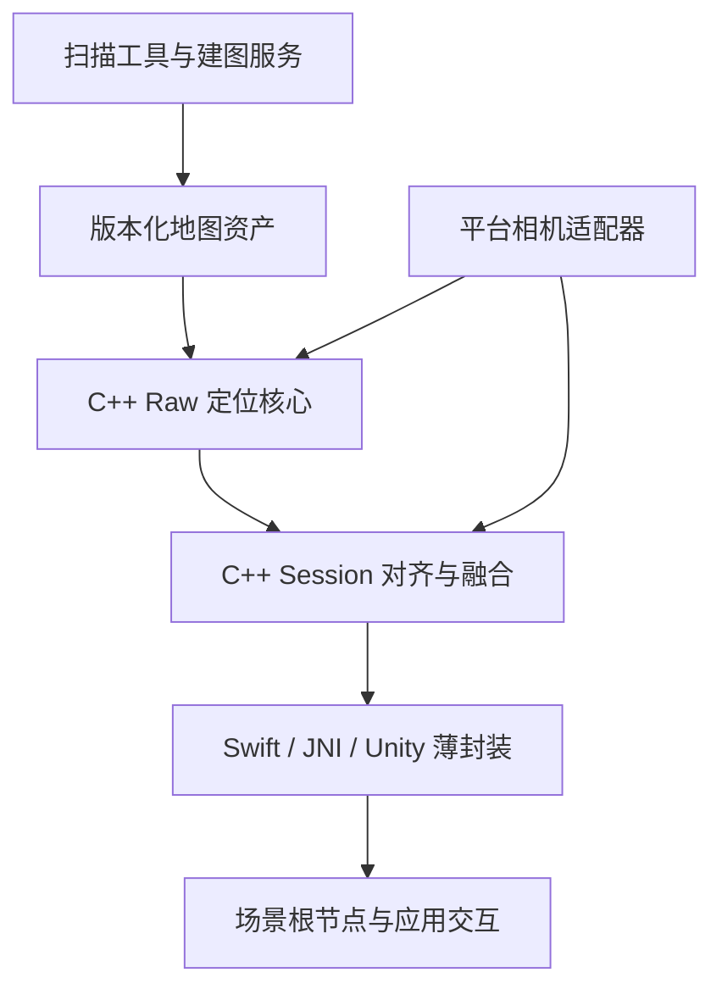

# Area Target 跨平台 SDK 设计

日期：2026-10-05。设计方向由用户在本次对话确认；以下将该方向具体化为接口与迁移边界。本文为规划，不表示新增接口、制品或平台已经实现。

当前执行修订：只实施M0/M1，保留通用接口，暂缓M2–M5。核心通过固定夹具后增加S01持续评估：现有iOS采集/回放作为验证宿主，核心迁移不改检索阈值，后续优化通过同输入基线/候选比较与独立验收晋升，不把平滑后的稳定显示当作Raw识别准确。

## 1. 分层与依赖



建图、ZIP/HTTP、登录、缓存与 GLB 渲染保留在当前工具/宿主。core 不调用 Unity、ARKit、Android、Rokid、PICO、Meta 或 OpenXR API。Session 只接受标准化数值数据；相机采集和 UI 生命周期保留在平台层。

借鉴 Immersal 的公开 PlatformSupport → Localizer/LocalizationMethod → SceneUpdater 数据流；不推断或复刻其未公开定位算法。应用使用设备跟踪控制相机，Area Target 结果更新地图内容根节点。[公开架构](https://developers.immersal.com/docs/unitysdk/immersalcomponents/)、[场景更新](https://developers.immersal.com/docs/unitysdk/immersalcomponents/sceneupdater/)

## 2. 当前基础与迁移原因

| 已存在的基础 | 本次需要解决的差异 |
|---|---|
| `native_visual_localizer/` 的 C++17/OpenCV 与 opaque handle | 当前 `vl_*` 带 Unity 参数，缺少长度、stride、结构版本及明确错误码 |
| Swift 和 Unity 均调用 `vl_process_frame_out` | Swift Raw 不传 AR 先验，Unity 传跟踪矩阵并启用另一套过滤 |
| Swift 严格 SQLite reader | Unity/Swift 重复解析、展开地图；资源限制不同 |
| Unity latest-frame worker 和 generation | 图像、内参、当前相机 transform 和事件时间尚未证明属于同一曝光帧 |
| Swift 私有动态 `AreaTargetNative.framework` | Unity 的静态 OpenCV 路径尚未统一隔离；与 Immersal 同进程存在符号混用风险 |
| macOS/iOS 构建与真实夹具 | Android CMake 分支不等于 NDK/AAR 或各头显已支持 |

基线检查以执行当时的文件与制品为准。此前测试记录仅证明对应版本，不直接移交为新 SDK 的验收。

## 3. C ABI v2

新增头文件 `native_visual_localizer/include/area_target_runtime.h`，使用 `atc_*` 独立符号；已有 `visual_localizer.h`、76-byte `VLResult`、48-byte `VLDebugInfo` 和全部 `vl_*` 入口冻结。`atc_get_api_version()` 返回 2；API 版本、资产 schema 和 SDK 发布版本是三种不同版本。

公共类型均以 `uint32_t struct_size, api_version` 开始，使用固定宽度整数、C-compatible POD、借用 buffer 与 out 参数。ABI 布局以目标架构下的 `sizeof/offsetof` 清单验证，不用跨架构硬编码 pointer offset。所有库异常在边界转换为状态码。

```c
typedef void* ATCHandle;
typedef void* ATCSessionHandle;
typedef int32_t ATCStatus;

uint32_t atc_get_api_version(void);
ATCStatus atc_create(const ATCConfigV2*, ATCHandle*);
ATCStatus atc_load_map(ATCHandle, const char* bundle_dir, ATCMapInfoV2*);
ATCStatus atc_localize(ATCHandle, const ATCFrameV2*, ATCResultV2*);
ATCStatus atc_reset(ATCHandle);
void atc_destroy(ATCHandle*);

ATCStatus atc_session_create(const ATCSessionConfigV2*, ATCSessionHandle*);
ATCStatus atc_session_update(ATCSessionHandle, const ATCResultV2*,
                           const ATCTrackingSampleV2*, ATCSessionResultV2*);
ATCStatus atc_session_reset(ATCSessionHandle, uint64_t map_generation,
                          uint64_t tracking_epoch);
void atc_session_destroy(ATCSessionHandle*);
```

具体结构、枚举、数据拥有权及错误码在 C01 创建的 `docs/contracts/area-target-runtime-v2.md` 冻结，C02 写入 C header。`ATCFrameV2` 包含 frame ID、capture ns、map generation、Gray8 pointer/length、宽高/stride 和内参；`ATCResultV2` 包含相同帧身份、map instance、`T_C_S`、validity、inliers 和重投影误差。跟踪时间/epoch、clock-mapping、pose/extrinsics validity 在单独 `ATCTrackingSampleV2` 中，不进入 Raw 定位。

`atc_localize` 同步执行，不保留相机 buffer。每个会话由宿主一个串行 worker 拥有，保留一个 latest pending slot；Swift、Unity 或 Kotlin 各自负责采集到 worker 的受控拷贝。C++ Session 同步执行共享状态机与融合，不另建第二条 native 队列。一个库句柄不能在多线程同时调用；reset/destroy 必须等待在途调用。独立会话不共享可变过滤状态。

`atc_destroy(&handle)` 完成后置空；重复销毁空句柄安全。无效句柄复制、destroy 与 process 并发仍是调用契约错误，不能宣称任意悬空指针可安全探测。

## 4. 坐标、图像与时间

- v2 `C` 是 RH 光学相机坐标，`S` 是原扫描 RH 地图，`W` 是规范化 RH 跟踪空间。native v2 输出 `T_C_S`；Session 只在有效跟踪样本下计算 `T_W_S`。
- 旧 API 保留现有 AR 相机轴语义。迁移初期可从 legacy 内部结果作显式的逆轴转换得到 v2 光学结果；不能修改旧返回值或再次变换数据库 3D 点。
- 每个宿主必须对变换的输入和输出坐标基同时转换。Unity 左手坐标与地图 mesh 导入转换共同验算，不能只翻转平移 Z、只转置或默认 `XROrigin.Camera` 就是物理 RGB 相机。
- adapter 输出 Rectified Gray8。宽高、内参和光学轴必须对应经过裁剪、缩放、去畸变后的图像；没有畸变参数的 SDK 只有明确文档或设备证据说明输出已校正，才可走零畸变路径。
- HMD 的 `T_W_C` 来自曝光时刻的 `T_W_H × T_H_C`，左右相机分别标识。校准、相机选择或 tracking origin 变化会改变 epoch，清除已有融合。
- adapter 保存源曝光时钟、映射到会话单调时间的方法和实测误差。同步限制是显式配置；第一版不同步时返回 Raw 而非用当前头部姿态补齐。重复/倒序帧拒绝，不能改写采集时间使其递增。
- 宿主用同一会话单调时钟在提交和交付结果时检查年龄上限；Session 用输入采集时间计算 alignment 年龄、顺序及 tracking skew，不猜测宿主时钟的 epoch。C01 固定这两类年龄的语义与配置来源，所有宿主使用同一策略。

## 5. 地图与资源

`atc_load_map` 读取经宿主验证的本地 bundle 中 `features.db`；core 不请求网络、不解压、不渲染模型、不解析账号信息。manifest、ZIP 完整性和已有 source fingerprint 在宿主资产层验证并冻结。core 返回地图实例与计数，宿主将其与资产 SHA256/版本关联。

共享 SQLite reader 采用当前 Swift 校验作为最低基线：只读连接、事务快照、普通表与字段类型检查、finite 数值、128-byte little-endian float64 pose、ORB32/AKAZE61、重复/孤立 ID 拒绝、非空数据、SQL 步数与时间限制。加载顺序为 vocabulary → 全部 ORB keyframes → 可选 AKAZE → build index。

初始兼容策略的上限沿用现有 reader：数据库 512 MiB、1000 keyframes、4096 vocabulary、总特征 200000、每帧 ORB 2000、AKAZE 8192、ORB×vocabulary 不超过 2 亿。限额进入 `ATCConfigV2` 的版本化 map policy，不能静默放宽。core 加载失败保留旧地图并销毁候选对象，但宿主必须将失败请求的新 generation 标为不可用，不能以新地图身份继续调用旧地图；旧地图只经显式回滚重新激活。取消由宿主 generation 与完成 barrier 管理。

没有 GLB 的合法特征地图仍可 Raw 定位。已知 legacy producer 由明确兼容分支解释，未知 schema/坐标/端序拒绝；不猜测。v2 迁移不修改既有数据库或服务器合同。

## 6. Raw、融合与生命周期

Raw 结果表示当帧图像成功识别地图；连续的 native 候选检索缓存可保留，但不接受 AR/VIO 位姿先验。比较回放继续使用 Raw，报告记录引擎/配置/API 版本。

Session 另外产生 alignment-valid 与 propagated-pose-valid 标记。无 VIO、不同时、跟踪质量不足或 epoch 重置时仍保留 Raw 指标；只有可验证 `T_W_C` 时允许内容对齐。VIO 延续已有对齐不能记成新的视觉识别成功。

共享过滤比较相对 `T_W_S` 的平移距离（米）和 SO(3) 角度（弧度），不使用 `||T_W_S-I||` 的混合标量。过滤、窗口、恢复计数及平滑时间常数均由 `ATCSessionConfigV2` 明确给出并写入报告。移植首先验证现有对齐/状态行为，再以固定数值夹具确认 origin 不变性；不在迁移中调 ORB/AKAZE 检索阈值。

宿主生命周期固定为：停止接收 → generation 递增 → 清空 pending/output → 等待在途同步调用 → reset/free → 恢复接收。后台、权限变更、地图切换、设备断开和 tracking origin reset 都通过这一边界处理。失败、陈旧结果和旧世代结果不移动内容。

## 7. 分发与平台包

| 制品 | 规划位置 | 集成方式 |
|---|---|---|
| iOS framework/Swift SDK | `ios_sdk/AreaTargetSDK/` | 私有 `AreaTargetNative.framework` 的 XCFramework 切片及 Swift 包装 |
| Android native/JNI SDK | `android_sdk/area-target-sdk/` | `libarea_target_runtime.so`、JNI、AAR；优先 arm64-v8a |
| Android 设备模块 | `android_sdk/area-target-platform-arcore/`、`area-target-platform-rokid/`、`area-target-platform-pico/`、`area-target-platform-quest/` | 可选 Gradle 模块依赖核心 AAR，厂商 SDK 仅由对应模块引入 |
| Unity core UPM | `unity_plugin/AreaTargetPlugin/` | v2 bridge/shared session；以 SDK/fixture 相同版本打包 |
| Unity 设备包 | `unity_plugin/AreaTargetPlatformARCore/`、`AreaTargetPlatformRokid/`、`AreaTargetPlatformPico/`、`AreaTargetPlatformQuest/` | 独立 frame provider、厂家 SDK 依赖和设备验证 |

CMake 新目标为 `area_target_runtime`；legacy `visual_localizer` 仍可独立构建。iOS v2 使用私有 OpenCV/SQLite，仅导出规范 C API；Unity v2 构建 preset 不再同时链接旧全局 OpenCV/定位器 archive。legacy preset 可回滚，但不允许一个进程加载两份重复 `vl_*` 定义。Android/Editor 的同源产物也验证依赖与符号，不能仅检查文件名存在。Android 核心 AAR 不依赖厂商采集 SDK，设备模块按选择注册，干净宿主无需安装其他厂商模块。

## 8. 验证、回滚和范围控制

每个任务保存命令、工具版本、源码身份、fixture/资产哈希和日志。CI 对可执行的合同/native/制品测试运行真实程序；缺少签名、Unity 许可证或物理设备时明确 SKIP。设备发布门禁把必需项缺失视为失败。

迁移逐宿主启用明确 v2 preset，不同时运行两套 worker/fusion。失败可切回上一版发布制品及 legacy preset，保留地图和用户扫描。新核心通过已有 legacy 回归后才可进入宿主迁移。

实现期间更新本目录 `tasks.md`，不把原 iOS tasks 9/10、未来平台支持或商业目标提前勾选。发布操作不包含在本地 `release` 核验命令中，遵循项目既有发布流程另行执行。

## 9. S01 持续测试与算法迭代

固定数据包由manifest和逐帧Gray8组成，地图、像素、K、时间、坐标和预处理均有身份记录。数据按场地/采集会话划分tune与held-out；正样本使用建图以后独立录制的查询，负样本含错误地图、其他空间、重复纹理及遮挡，unknown标签不进入正/负分母。现有iOS recorder可复用，聚合比较报告v1保持兼容，数据导出单独保存逐帧内容。

baseline与candidate运行独立新句柄、相同地图和完整有序帧序列，不传VIO先验，不删除失败帧。保存每帧status、pose有效性、inliers、重投影误差、耗时，以及源码/二进制/配置/环境身份。所有变换归一到光学C；iOS的ARKit相机位姿先作明确光学基转换后才用于稳定性计算。

识别返回率=正样本有效Raw数/正样本总数，误识别率=负样本有效Raw数/负样本总数。仅独立真值存在时统计相机在S的位置误差、旋转误差和准确召回率，失败同样进入分母。稳定性比较共同成功帧对的`T_W_C*T_C_S`变化，同时记录失败串、恢复时间和成功覆盖率，不能靠拒绝困难帧伪装改善。加载耗时和每帧core调用耗时单列，iOS排队/端到端耗时分开。

门槛在调优前配置冻结：held-out识别数不降、负样本误识别数不增，有真值时精度不退化；稳定性使用相同成功帧对；性能只在同环境反复交替AB/BA回放后作比较。无负样本、无共同帧对、无真值或跨环境时对应指标为未测/证据不足，不能自动晋升候选。每轮只改变一个可解释因素，失败样例加入回归；通过离线门禁后，再用iPhone/iPad新现场会话复核。合成夹具只用于验证代码链路与指标计算。

## 本地数据复用（2026-10-05 实际核查）

优先使用工程自带的 `unity_project/Assets/StreamingAssets/ScanData`（94 帧）和 `ScanData_data1`（64 帧），配合 `SLAMTestAssets/features.db`（92 个关键帧、127685 条 ORB、1000 个词）。原始 JPEG 均为 1920×1440；两组图像没有字节相同的文件。94 帧中的建图位姿与数据库一致，定位结果用于建图回归；64 帧场地来源尚需核对，先按 `unknown` 标签回放，不能推定全部是正样本。

使用 `tools/localization/import_scan.py` 导入为独立、带 SHA256 的 Gray8 数据集，保留 JPEG、原有位姿/内参和解码器版本作为来源证据。旧扫描缺少逐帧方向/校正证据，必须显式启用 `--legacy-diagnostic`，限定 `tune`，禁止候选晋升。图像不缩放，ARKit 列存储位姿转换为光学相机的 row-major `T_W_C`。不把 ARKit 位姿填成独立真值。

后续 iOS 使用现有扫描导出流程补采完整元数据；导入器读取新版扫描 manifest 的逐帧内参/尺寸/方向。独立验收还需新会话、真实负样本和独立位姿真值。具体命令、来源核查和限制见 [本地数据](../../../validation/local-data.md)；固定回放、门槛和失败样例见 [迭代方法](../../../localization-iteration.md)。
